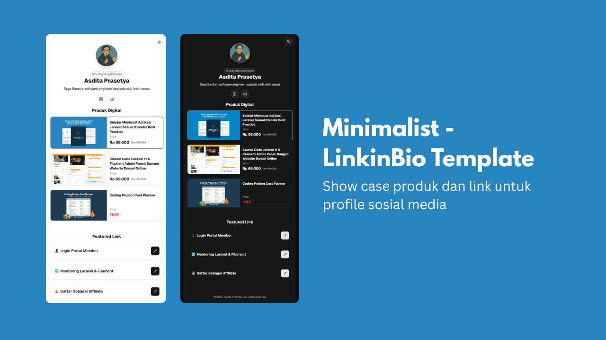

# Link in Bio - Next.js & Tailwind CSS



Project ini adalah aplikasi Link in Bio modern yang dibangun dengan Next.js 15 (App Router), TypeScript, dan Tailwind CSS v4. Konten diatur lewat file JSON untuk links dan MDX untuk produk digital sehingga mudah dikurasi tanpa menyentuh logika aplikasi.

## Fitur Utama
- **Mobile First**: Semua komponen dioptimalkan untuk tampilan mobile dan tetap mulus di layar besar.
- **Profile Card**: Data profil dengan avatar, nama, dan deskripsi ringkas.
- **Product Carousel & Cards**: Menampilkan produk digital lengkap dengan harga, status featured, dan preview.
- **MDX Product Content**: Detail produk menggunakan MDX dengan komponen khusus (Callout, FeatureGrid) untuk konten rich.
- **Link List**: Daftar link yang dikelompokkan berdasarkan kategori dari file `links.json`.
- **Dark Mode**: Toggle dark mode di header menggunakan komponen shadcn/ui.
- **TypeScript**: Full TypeScript support untuk type safety dan DX yang konsisten.

## Tech Stack
- **Framework**: Next.js 15.4.1 (App Router)
- **Language**: TypeScript
- **Styling**: Tailwind CSS v4
- **UI Components**: shadcn/ui (Radix UI + Tailwind)
- **Icons**: Lucide React
- **Carousel**: Embla Carousel
- **Analytics**: Vercel Analytics

## Setup & Menjalankan
1. **Install dependencies**
   ```bash
   npm install
   # atau
   yarn install
   ```
2. **Jalankan development server**
   ```bash
   npm run dev
   # atau
   yarn dev
   ```
3. **Akses di browser**
   Buka [http://localhost:3000](http://localhost:3000)

## Kustomisasi Data
- **Links**: Edit `src/app/data/links.json` untuk menambah/mengubah link.
- **Products**: Tambah atau edit file MDX di `src/content/products/`. Gunakan frontmatter untuk metadata dan body MDX untuk konten rich.
- **Profile**: Edit data profil di `src/app/components/ProfileCard.tsx`.
- **Articles**: Tambah atau ubah file markdown di `src/content/articles/`.

## Struktur Data

### Links JSON
```json
[
  {
    "type": "default",
    "label": "Link Label",
    "url": "https://example.com",
    "category": "Category Name"
  }
]
```

### Product MDX
```mdx
---
id: product-slug
slug: product-slug
category: Produk Digital
type: product
name: Nama Produk
thumbnail: /products/image.jpg
coverImage: /products/image-hero.jpg
url: https://example.com
price: 99000
original_price: 199000
summary: Deskripsi singkat untuk kartu
sneakPeek:
  - /products/image-1.jpg
  - /products/image-2.jpg
highlights:
  - Highlight penting pertama
  - Highlight penting kedua
position: 1
ctaLabel: "Pesan Template Sekarang"
ctaUrl: https://example.com/checkout
ctaHelperText: "Langganan update gratis seumur hidup."
disableStickyCta: false
---

## Heading Konten

Konten detail produk ditulis dengan Markdown + JSX. Anda dapat menggunakan komponen khusus seperti `<Callout>` atau `<FeatureGrid>` untuk menyusun bagian highlight, FAQ, dsb.
```

Field tambahan:
- `ctaLabel` dan `ctaUrl` (opsional) untuk menyesuaikan tombol order utama.
- `ctaHelperText` menambahkan catatan singkat di atas tombol.
- `disableStickyCta: true` menyembunyikan tombol order sticky bawaan—berguna ketika Anda menampilkan CTA langsung di konten MDX.

Gunakan komponen `<OrderCTA>` di dalam MDX untuk menyisipkan tombol order dengan styling konsisten shadcn/ui:

```mdx
<OrderCTA
  href="https://example.com/checkout"
  label="Beli versi Pro"
  note="Termasuk akses ke update bulanan dan komunitas Discord"
/>
```

## Catatan
- Gambar produk tersedia di folder `public/products/`.
- Gambar umum tersedia di folder `public/images/`.
- Komponen MDX khusus berada di `src/components/mdx/`.
- Tailwind config sudah mobile first dan mendukung dark mode.
- TypeScript types tersedia di `src/app/types/`.

## Scripts Available
- `npm run dev` - Development server dengan Turbopack
- `npm run build` - Build production
- `npm run start` - Start production server
- `npm run lint` - ESLint check

---

> Dibuat dengan ❤️ oleh @codingtengahmalam
